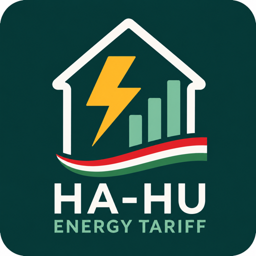

🇬🇧 [English](README.md) | 🇭🇺 **Magyar**

<p align="center">
  
</p>

# Hungarian Energy Tariffs / Magyar Energia Tarifák

[](https://github.com/miklosbagi/ha-hu-energy-tariff/actions/workflows/ci.yml)
[](https://github.com/miklosbagi/ha-hu-energy-tariff/actions/workflows/e2e.yml)
<br>
[](https://github.com/miklosbagi/ha-hu-energy-tariff/releases)
[](https://github.com/miklosbagi/ha-hu-energy-tariff/pulse)
[](LICENSE)

Egy Home Assistant egyéni integráció, amely a magyarországi lakossági **villamosenergia-tarifák** aktuális egységárát, a kedvezményes keret felhasználását és a becsült költségeket számolja ki bármely meglévő hálózati energiafogyasztás-mérő szenzor alapján — mérő-/gyártófüggetlen módon, a natív **Energy Dashboardba** illesztve.

Kulcsszavak: Home Assistant, Magyarország, MVM, MVM Next, ESZ, A1, A2, H tarifa, 2523 kWh, rezsicsökkentés, villamosenergia tarifa, villamosenergia költség, Energy Dashboard.

## Funkciók

- **Szolgáltató / Elosztói terület / Tarifa / Árazási időszak / Mérő** különálló, önálló fogalmakként modellezve — nem beégetett feltételezésekként —, így egy új szolgáltató, elosztó vagy tarifakonstrukció hozzáadása adatváltozás, nem újratervezés. A döntés indoklása: [docs/DESIGN.md](docs/DESIGN.md) (angol nyelven).
- **A1 tarifa** (MVM/ESZ lakossági, egyzónás, arányosított éves kedvezményes kerettel) végponttól végpontig megvalósítva.
- Helyes **2523 kWh/tarifaév** kedvezményes keret arányosítás eltelt napok szerint (augusztus 1. – július 31. tarifaév, 365 és 366 napos évekre egyaránt).
- Ha egyetlen fogyasztási delta átlépi a hátralévő keret határát, a rendszer **szétbontja** kedvezményes és piaci árú részre — sosem árazza az egészet egyetlen áron.
- Home Assistant újraindítást és mérőállás-visszaállást (reset) dupla számolás nélkül túlél.
- Árazási érvényességi időszakok: egy áremelés soha nem számolja újra visszamenőlegesen a már felhalmozott költséget.
- `current_price` entitást biztosít, amely közvetlenül használható az Energy Dashboard hálózati fogyasztás aktuális-ár forrásaként, valamint saját `total_cost` számítást is végez (a magyar tarifaszabályok nem mindig egyenlők azzal, hogy `current_price × minden dashboard-növekmény`).
- Magyar és angol felhasználói felület.

## Ütemterv

| Prio | Tarifa | Mechanizmus | Mérők | Állapot |
|---|---|---|---|---|
| 0 | A1 | Keretalapú, egész napos egységár | 1 (fő) | **Megvalósítva** |
| 1 | A2 | Idős zónás (csúcs/völgy) + keret | 1 (fő) | Katalógusban fenntartva, nincs megvalósítva |
| 1 | B Alap | Vezérelt "éjszakai", napi 8 óra, külön mérő, kedvezményes ár, fogyasztási limit | 2 (fő + vezérelt) | Katalógusban fenntartva, nincs megvalósítva |
| 1 | H | Szezonális, hőszivattyúkhoz, külön mérő | 2 | Katalógusban fenntartva, nincs megvalósítva |
| 2 | B Komfort | Vezérelt, napi 12 óra | 2 | Katalógusban fenntartva, nincs megvalósítva |
| 2 | B GEO | Korábbi hőszivattyús konstrukció, speciális esetek | 2 | Katalógusban fenntartva, nincs megvalósítva |

Egy új tarifa hozzáadása ebből a listából: egy `TariffStrategy` alosztály implementálása a `custom_components/hu_energy_tariff/tariffs/` alatt, majd regisztrálása — nincs szükség a konfigurációs folyamat, a koordinátor vagy az entitásréteg módosítására. Lásd: `tariff_engine.py`, `tariffs/registry.py`, és [docs/DESIGN.md](docs/DESIGN.md).

### Tarifaárak automatizált frissítése

A magyarországi hatóságilag szabályozott villamosenergia-árakat (a kedvezményes tarifák egységárai, maga a 2523 kWh-s keret, ÁFA) miniszteri/MEKH rendelet határozza meg, és az egyetemes szolgáltató teszi közzé — ezeket az integrációnak soha nem szabad futásidőben lekérdeznie. A specifikáció kifejezetten kizárja, hogy az integráció szolgáltatói weboldalakat "scrape-eljen" futás közben, mivel a felhasználók a konfigurációs felületen saját, ténylegesen szerződött áraikat állítják be, függetlenül attól, hogy egy alapértelmezett érték mit sugall.

Amit ehelyett érdemes automatizálni, az a `const.py`-ban lévő **alapértelmezett értékek** karbantartása, mint karbantartói feladat: egy időszakos szkript/GitHub Action, amely figyeli az alábbi hivatalos forrásokat, és PR-t nyit a `DEFAULT_A1_*` (majd a jövőbeli A2/B/H) alapértékek frissítésére — a jóváhagyás és a merge továbbra is emberi feladat marad. Ez egy backlog tétel, még nincs megvalósítva.

Figyelendő hivatalos források:
- [MVM Next – Lakossági egyetemes szolgáltatói egységárak](https://www.mvmnext.hu/aram/pages/aloldal.jsp?id=18223) (hivatalos lakossági egységár-táblázatok, elosztónként)
- [MVM Next – Árak, árszabások](https://www.mvmnext.hu/aram/pages/aloldal.jsp?id=862) (tarifa-áttekintő oldal)
- [4/2011. (I. 31.) NFM rendelet](https://net.jogtar.hu/jogszabaly?docid=a1100004.nfm) — a villamosenergia egyetemes szolgáltatás árképzéséről szóló miniszteri rendelet (a kedvezményes/piaci felosztás és a 2523 kWh-s keret jogi alapja)
- [MEKH](https://mekh.hu/) — Magyar Energetikai és Közmű-szabályozási Hivatal, a rendszerhasználati díjakról szóló rendeletekhez (pl. 10/2024), amelyekre az elosztási díj komponensek hivatkoznak

## Telepítés

### HACS

1. HACS → Integrations → ⋮ → Custom repositories → add ehhez a repóhoz tartozó URL-t, kategória: "Integration".
2. Telepítsd a "Hungarian Energy Tariffs" integrációt, majd indítsd újra a Home Assistantot.

### Manuális / docker-compose

A Home Assistant egyéni integrációknak mindegy, hogyan van telepítve maga a HA — másold vagy csatold kötetként (volume mount) ennek a repónak a `custom_components/hu_energy_tariff/` könyvtárát a HA konfigurációs könyvtárad `custom_components/` mappájába (pl. abba a kötetbe, amit már most is `/config`-ként csatolsz a `docker-compose.yml`-edben), majd indítsd újra a Home Assistantot.

## Konfiguráció

Beállítások → Eszközök és szolgáltatások → Integráció hozzáadása → "Hungarian Energy Tariffs":

1. **Név, szenzor és terület** (egy képernyőn) — adj meg egy nevet, válaszd ki a meglévő hálózati fogyasztásmérő szenzorodat (`device_class: energy`, `state_class: total` vagy `total_increasing` szükséges; a teljes élettartamra vonatkozó `total` szenzor az előnyösebb, de a naponta nullázódó `total_increasing` szenzor is helyesen működik), és az elosztói területedet (E.ON, MVM/ÉMÁSZ, OPUS, MVM Démász, ELMŰ) — a számládon az "Elosztói engedélyes" sorban szerepel, vagy nézd meg az ezen a képernyőn linkelt hivatalos MVM árlapot.
2. **Tarifa árak** (egy képernyő, két szakasz) — minden összeg Ft/HUF-ban:
   - **Villamosenergia ár**: éves kedvezményes keret, kedvezményes/piaci energiaár (nettó Ft/kWh) — a számládon szereplő "ESZ Lakossági 'A1' kedv./piaci ár" soroknak felel meg.
   - **Rendszerhasználati díjak**: elosztói forgalmi díj, átvételi forgalmi díj (nettó Ft/kWh), és a fix havidíj (nettó Ft) — a számládon szereplő "Elosztói forgalmi díj" / "Átvételi forgalmi díj" / "Elosztói alapdíj" soroknak felel meg.

(A szolgáltató- és tarifaválasztó képernyők automatikusan kimaradnak, amíg csak egy-egy lehetőség van — jelenleg MVM Next és A1 — és maguktól visszatérnek, amint egy második szolgáltató vagy tarifa is elérhető lesz.)

Az árak **nettó** árak (27% ÁFA nélkül) — az ÁFA-t az integráció automatikusan hozzáadja. Az alapértékek az MVM hivatalos árlapja alapján vannak előtöltve (a kedvezményes energiaár az 1. lépésben választott elosztói területtől függ, minden más nem) — érdemes ellenőrizni őket a tényleges számládon szereplő értékek alapján, ez egyben azt is igazolja, hogy az integráció végösszege megegyezik a ténylegesen kiszámlázott összeggel.

Az árakat később az integráció **Konfigurálás** (opciók) folyamatán keresztül módosíthatod — ez egy új árazási érvényességi időszakot nyit meg a régi felülírása helyett, így a már felhalmozott költség helyes marad.

### Energy Dashboard bekötése

Beállítások → Dashboardok → Energy → Elektromos hálózat → Hálózati fogyasztás → "Use an entity with current price" → válaszd ki ennek az integrációnak a `current_price` entitását. Használd a `total_cost`-ot, ha az integráció saját költségszámítását szeretnéd a dashboard beépített ár × fogyasztás számítása helyett.

## Entitások

`current_price` (Ft/kWh), `total_consumption`, `discounted_consumption`, `market_consumption`, `discounted_quota`, `remaining_discounted_quota`, `variable_cost`, `fixed_cost`, `total_cost` (Ft).

A `discounted_quota` és a `fixed_cost` is attól az időponttól arányosít, amikor az árazási időszak ténylegesen életbe lépett (vagyis a beállításkor, vagy a legutóbbi Configure-en keresztüli áreditáláskor) — soha nem visszamenőlegesen az augusztus 1-jei tarifaév-kezdettől. Ha év közben állítod be az integrációt, nem fog egyből egy egész évnyi "elhasznált" keretet vagy fix díjat mutatni.

## Fejlesztés

```bash
python3 -m venv .venv
source .venv/bin/activate
pip install -r requirements-dev.txt
```

**Unit tesztek** (headless tarifamotor-tesztek és Home Assistant-bootoló integrációs tesztek, mind a `tests/unit` alatt):

```bash
pytest tests/unit
```

**End-to-end füst teszt** (egy valódi Home Assistant konténert indít docker-compose-zal, Docker szükséges hozzá) — szándékosan külön `requirements-e2e.txt`-t használ a `requirements-dev.txt` helyett, mivel a `pytest-homeassistant-custom-component` (amit a `tests/unit` igényel) blokkolja a konténerhez intézett valódi hálózati hívásokat:

```bash
pip install -r requirements-e2e.txt
pytest tests/e2e
```

A tarifaszámítási motor (`models.py`, `tariff_engine.py`, `tariffs/`) szándékosan független a Home Assistant entitásrétegtől, így a hozzá tartozó tesztek Home Assistant indítása nélkül futnak — lásd a háromrétegű tesztelési stratégiát a [docs/DESIGN.md](docs/DESIGN.md#testing-strategy-three-layers-each-proving-something-different) dokumentumban (angol nyelven).

## Dokumentáció

- [docs/DESIGN.md](docs/DESIGN.md) — az objektummodell, a tarifamotor stratégia-mintája, a perzisztencia és a tesztelési megközelítés mögötti tervezési döntések (angol nyelven).
- [docs/RELEASING.md](docs/RELEASING.md) — hogyan működik a verziózás és a release-készítés (angol nyelven).

## Licenc

MIT — lásd: [LICENSE](LICENSE).
